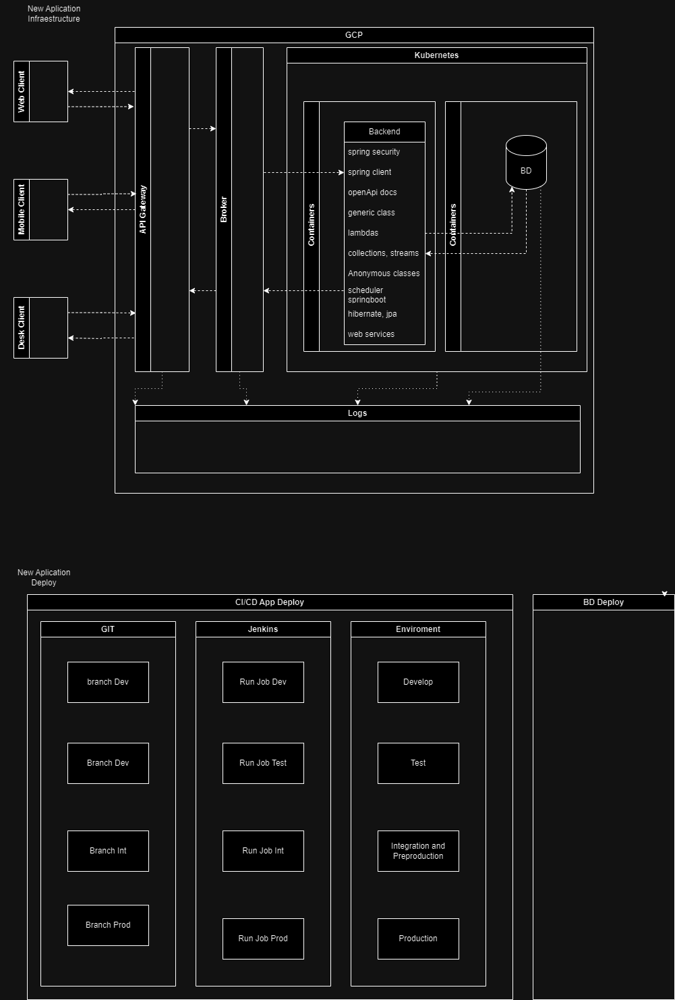

# New Aplication

## Ambientacion

Para desarrollar esta aplicación en Java con Google Cloud Platform (GCP) de manera local,se requieren las siguientes herramientas.

Java Development Kit (JDK):

Asegúrate de tener instalado el JDK  version 19 en tu sistema. Usa la version del sitio oficial de Oracle.

Entorno de Desarrollo Integrado (IDE):

Utiliza Eclipse o Visual Studio Code.

Google Cloud SDK:

El SDK de Google Cloud incluye herramientas de línea esenciales ( CLI de gcloud ) para interactuar con los servicios que ocuparemos dentro de GCP.

Maven:

Estas herramientas de gestión de dependencias y construcción es util para manejar las bibliotecas y plugins necesarios para tu Proyecto

Spring Tools Suite:

Spring Boot simplifica mucho el proceso de creacion de servicios. 

Docker:

Para contenerizar la aplicación, usaremos Docker y para su orquestacion kubenetes.

Google Cloud Libraries for Java:
Estas bibliotecas te permiten interactuar fácilmente con los servicios de GCP desde tu aplicación Java. 

Postman:

Se añade una colleccion de servicios que permitira realizar pruebas despues del deploy en cada ambiente.

## Primeros pasos
Despues de la instalacion de las herramientas que utilizaremos, se hacer un setup de estas.

### Configurar el SDK de Google Cloud:

Una vez instalado, ejecuta gcloud init para configurar tu entorno y autenticarte con tu cuenta de Google.

Crear un Proyecto en GCP:

Despues de instalar  CLI de gcloud, ejecuta el siguiente comanda para instalar App engine

`gcloud components install app-engine-java`


Ve a la consola de Google Cloud y crea un nuevo proyecto. 

### Configurar variables de entorno

Autenticarte con tu Cuenta de Usuario

Abre una terminal y ejecuta el siguiente comando para autenticarte

`gcloud auth application-default login`

Sigue las instrucciones para iniciar sesión con tu cuenta de Google. Esto generará un archivo de credenciales en tu sistema local.

Configurar la Variable de Entorno GOOGLE_APPLICATION_CREDENTIALS apuntando al archivo de credenciales generado

`GOOGLE_APPLICATION_CREDENTIALS="/ruta/a/tu/archivo/credenciales.json"`

Reemplaza `"/ruta/a/tu/archivo/credenciales.json"` con la ruta real al archivo de credenciales en tu sistema.

### Antes de ejecutar 

Asegurate que este integrado el plugin de Google para en maven con la siguiente configuracion en el pom.

```
<plugin>
   <groupId>com.google.cloud.tools</groupId>
   <artifactId>appengine-maven-plugin</artifactId>
   <version>2.7.0</version>
</plugin>
```
Desarrollar y Probar Localmente:

Realiza pruebas unitarias con el archivo que incluye la colleccion de Postan en donde tendremos los servios y asegúrate de que todo funcione correctamente en tu entorno local antes de desplegarlo en GCP.

### Contenerizar

Crear un Dockerfile

En el directorio raíz de tu proyecto, crea un archivo llamado Dockerfile con el siguiente contenido:

Usar una imagen base de Java

`docker pull openjdk:23 `
`FROM openjdk:23`

Establecer el directorio de trabajo

`WORKDIR /app`

Copiar el archivo JAR de la aplicación al contenedor

`COPY target/tu-aplicacion.jar java_app.jar`

Exponer el puerto en el que la aplicación se ejecutará

`EXPOSE 8080`

Comando para ejecutar la aplicación

`ENTRYPOINT ["java", "-jar", "java_app.jar"]`

Construye la imagen Docker utilizando el siguiente comando:

`docker build -t nueva-app-java .`

Prueba la imagen Docker localmente para asegurarte de que funciona correctamente:

`docker run -p 8080:8080 nueva-app-java`


### Subir la Imagen a Google Container Registry (GCR)
Autentícate con Google Cloud y configura el proyecto:

`gcloud auth login`

`gcloud projects list `

`gcloud config set project proyecto-java-valex`

Etiqueta la imagen Docker para Google Container Registry:

`gcloud auth configure-docker` 

`docker tag nueva-app-java gcr.io/proyecto-java-valex/nueva-app-java`

Sube la imagen a Google Container Registry:

`docker push gcr.io/proyecto-java-valex/nueva-app-java`


### Configurar Google Kubernetes Engine (GKE)

Habilita la API de Kubernetes Engine 

Instala el plugin de gke:

`gcloud components install gke-gcloud-auth-plugin`
 
Crea un clúster:

`gcloud container clusters create cluster-valex --zone us-central1-a` 

Desplegar la Aplicación en GKE

Crea un archivo de despliegue deployment.yaml con el siguiente contenido:

```
apiVersion: apps/v1
kind: Deployment
metadata:
  name: nueva-app-java
spec:
  replicas: 3
  selector:
    matchLabels:
      app: nueva-app-java
  template:
    metadata:
      labels:
        app: nueva-app-java
    spec:
      containers:
      - name: nueva-app-java
        image: gcr.io/tu-proyecto-id/nueva-app-java
        ports:
        - containerPort: 8080
        
```
Aplica el despliegue a tu clúster:

`kubectl apply -f deployment.yaml`

Exponer la Aplicación

Crea un archivo de servicio service.yaml para exponer tu aplicación:

```
apiVersion: v1
kind: Service
metadata:
  name: nueva-app-java
spec:
  type: LoadBalancer
  selector:
    app: nueva-app-java
  ports:
    - protocol: TCP
      port: 80
      targetPort: 8080
```

Aplica el servicio a tu clúster:

`kubectl apply -f service.yaml`

Verificar el Despliegue

Obtén la IP externa del servicio para acceder a tu aplicación:

`kubectl get services`


## Screenshots



### Desplegar la Imagen en Google Cloud Run

Habilita la API de Cloud Run si aún no lo has hecho:

`gcloud services enable run.googleapis.com`

Despliega la imagen en Cloud Run:

`gcloud run deploy tu-aplicacion \
  --image gcr.io/tu-proyecto-id/tu-aplicacion \
  --platform managed \
  --region us-central1 \
  --allow-unauthenticated`

Verificar el Despliegue

Una vez que el despliegue se complete, recibirás una URL donde tu aplicación estará disponible. Puedes acceder a esta URL para verificar que tu aplicación esté funcionando correctamente.
